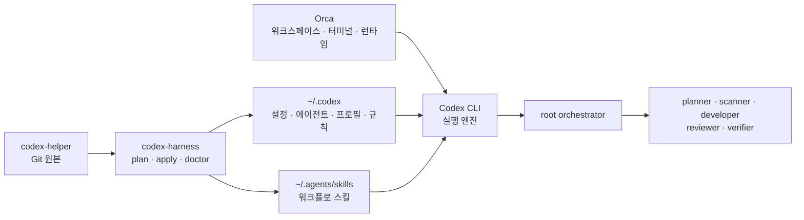

# Orca Codex CLI Runtime User Guide Implementation Plan

> **For agentic workers:** REQUIRED SUB-SKILL: Use superpowers:subagent-driven-development (recommended) or superpowers:executing-plans to implement this plan task-by-task. Steps use checkbox (`- [ ]`) syntax for tracking.

**Goal:** Explain the Orca-hosted Codex CLI multi-agent runtime in `docs/user-guide.md` with a Mermaid diagram and make YAML frontmatter a durable project documentation rule.

**Architecture:** Keep runtime behavior unchanged. Add one contract test, one concise global documentation convention, and one self-contained user-guide section positioned between daily operations and workflow usage.

**Tech Stack:** Markdown, Mermaid, Python `unittest`, Git

---

### Task 1: Add the documentation contract

**Files:**
- Modify: `tests/test_sources.py`
- Test: `tests/test_sources.py`

- [ ] **Step 1: Add the failing contract test**

Add this method to `SourceContractTests` after `test_user_guide_covers_skill_lifecycle`:

```python
    def test_user_guide_covers_orca_codex_runtime(self):
        guide = (ROOT / "docs/user-guide.md").read_text()
        guidance = (ROOT / "AGENTS.md").read_text()

        self.assertTrue(guide.startswith("---\n"))
        for phrase in (
            "Orca에서 Codex CLI 멀티에이전트 실행",
            "```mermaid",
            "codex-harness",
            "상주 프로세스",
            "runtime ID",
            "복구 snapshot",
            "root orchestrator",
            "새 Codex 작업",
        ):
            self.assertIn(phrase, guide)

        self.assertIn("YAML frontmatter", guidance)
        for field in ("title", "description", "date", "tags"):
            self.assertIn(field, guidance)
```

- [ ] **Step 2: Run the focused test and verify it fails**

Run:

```bash
uv run python -m unittest tests.test_sources.SourceContractTests.test_user_guide_covers_orca_codex_runtime -v
```

Expected: `FAIL` because `docs/user-guide.md` has no frontmatter or Orca runtime section and `AGENTS.md` has no frontmatter rule.

- [ ] **Step 3: Commit the failing contract**

```bash
git add tests/test_sources.py
git commit -m "test: require Orca runtime documentation"
```

### Task 2: Document the runtime and frontmatter convention

**Files:**
- Modify: `AGENTS.md`
- Modify: `docs/user-guide.md`
- Test: `tests/test_sources.py`

- [ ] **Step 1: Add the project documentation rule**

Add this section before `Harness Independence` in `AGENTS.md`:

```markdown
## Documentation

- New Markdown documents must start with YAML frontmatter containing `title`, `description`, `date`, and `tags`.
- When directly updating a maintained Markdown document that lacks frontmatter, add it if doing so is within the requested scope.
- Do not rewrite generated artifacts or vendored upstream documents solely to add frontmatter.
```

- [ ] **Step 2: Add frontmatter to the user guide**

Prepend:

```yaml
---
title: "Codex 하네스 사용자 가이드"
description: "codex-helper 설치, 운용, 멀티에이전트 실행, 스킬 관리와 장애 대응 가이드"
date: 2026-07-20
tags:
  - codex-helper
  - user-guide
  - multi-agent
  - operations
---
```

- [ ] **Step 3: Add the Orca runtime reference section**

Between `일상 운용` and `제공 워크플로`, add:

````markdown
## Orca에서 Codex CLI 멀티에이전트 실행

`codex-helper`는 상주 앱이나 멀티에이전트 서버가 아니다. Git으로 버전 관리되는 원본과 이를 사용자 환경에 배포·검증·복구하는 하네스다. 실제 실행환경은 Orca가 호스팅하는 Codex CLI 프로세스다.



`codex-harness`는 명령 실행 중에만 동작하며 상주 프로세스가 아니다. Orca는 프로젝트 작업공간, 터미널과 Codex CLI 프로세스의 생명주기를 관리한다. Codex CLI는 설정과 역할을 로드하고 root가 필요한 subagent를 spawn하도록 실행한다.

### 구성요소의 책임

- **역할**: `scanner`, `planner`, `developer`, `reviewer`, `verifier`는 항상 실행되는 프로세스가 아니라 root가 필요할 때 spawn하는 실행 프로필이다.
- **프로필**: `deep-review`, `fast-scan`은 Codex 세션의 모델과 추론 기본값을 선택하는 설정 오버레이다.
- **스킬**: `feature-delivery`, `parallel-review`, `dual-loop-review`는 root가 따르는 재사용 워크플로이며 자체 실행 엔진이 아니다.
- **규칙**: `codex-helper.rules`는 명령 실행과 승인 경계를 정의한다.

### 상태 출력 해석

- 역할이 활성이라는 결과는 역할이 런타임 dispatch 목록에 등록됐다는 뜻이다. 다섯 역할이 동시에 실행 중이라는 뜻은 아니다.
- `current`와 대기 변경 0개는 Git 원본의 선언 상태와 실제 사용자 환경의 배선이 일치한다는 뜻이다.
- Orca `runtime ID`는 Orca가 관리하는 현재 런타임 인스턴스의 식별자이며 하네스나 Git 버전 ID가 아니다.
- 복구 snapshot은 `apply` 직전 관리 대상 링크와 설정을 복원하기 위한 하네스 영수증이다. VM이나 Codex 프로세스 전체 snapshot이 아니다.
- 동시 실행 한도는 열린 에이전트 스레드 수를 제한한다. root를 포함해 한도를 계산하며, 역할 등록 수와 동시 실행 수는 서로 다르다.
- `max_depth = 1`이면 root가 직접 자식 에이전트를 만들 수 있지만 자식이 다시 손자 에이전트를 만들지는 않는다.

### 적용과 런타임 로드

`codex-harness apply --yes`는 디스크의 설정과 링크를 갱신하지만 이미 열린 Codex 작업의 에이전트 레지스트리를 바꾸지는 않는다. 적용 후에는 새 Codex 작업을 시작한다. 새 작업에서도 이전 상태가 보이면 Orca/Codex 런타임을 재시작한 뒤 다시 확인한다.

```text
scanner 커스텀 에이전트를 하나 실행해서 README의 첫 제목만 보고해줘.
```
````

- [ ] **Step 4: Run the focused contract and verify it passes**

Run:

```bash
uv run python -m unittest tests.test_sources.SourceContractTests.test_user_guide_covers_orca_codex_runtime -v
```

Expected: `OK`, 1 test passed.

- [ ] **Step 5: Commit the implementation**

```bash
git add AGENTS.md docs/user-guide.md
git commit -m "docs: explain Orca Codex runtime"
```

### Task 3: Verify the final documentation state

**Files:**
- Verify: `AGENTS.md`
- Verify: `docs/user-guide.md`
- Verify: `tests/test_sources.py`

- [ ] **Step 1: Verify Mermaid and frontmatter structure**

Run:

```bash
uv run python - <<'PY'
from pathlib import Path

guide = Path("docs/user-guide.md").read_text()
assert guide.startswith("---\n")
assert guide.count("```mermaid") == 1
assert guide.count("```", guide.index("```mermaid")) >= 2
for field in ("title:", "description:", "date:", "tags:"):
    assert field in guide.split("---", 2)[1]
print("frontmatter=ok mermaid=ok")
PY
```

Expected: `frontmatter=ok mermaid=ok`.

- [ ] **Step 2: Run the complete suite**

Run:

```bash
./tools/run-tests
```

Expected: all tests pass, including the new documentation contract.

- [ ] **Step 3: Check whitespace and scope**

Run:

```bash
git diff --check master...HEAD
git status --short
git diff --name-only master...HEAD
```

Expected: no whitespace errors; only the plan, contract test, `AGENTS.md`, and `docs/user-guide.md` are implementation-branch changes. The user's `docs/user-report/UR001_kickoff.md` change remains only in the original checkout.

- [ ] **Step 4: Record plan completion**

Mark every completed checkbox in this plan and commit it:

```bash
git add docs/superpowers/plans/2026-07-20-orca-codex-runtime-user-guide.md
git commit -m "docs: complete Orca runtime guide plan"
```
