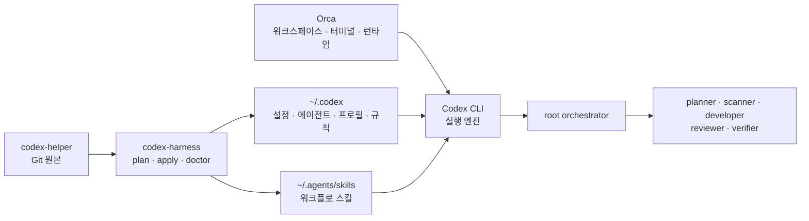

# Orca Codex CLI 런타임 사용자 가이드 설계

## 목적

`docs/user-guide.md`에서 `codex-helper`가 상주 실행환경인지, Orca와 Codex CLI가 각각 무엇을 실행하는지, 하네스 적용 결과를 어떻게 해석하는지 한 번에 이해할 수 있게 한다.

## 범위

- `일상 운용` 다음, `제공 워크플로` 앞에 `Orca에서 Codex CLI 멀티에이전트 실행` 섹션을 추가한다.
- Mermaid로 원본 저장소, 하네스, 사용자 설정, Orca, Codex CLI, root와 subagent의 관계를 표시한다.
- 역할, 프로필, 스킬, 규칙, runtime ID, 복구 snapshot, `current`, 대기 변경 수, 동시 실행 한도와 재시작 조건을 설명한다.
- 새 Markdown 문서는 YAML frontmatter를 포함한다는 프로젝트 문서 규칙을 `AGENTS.md`에 추가한다.
- 기존 `docs/user-guide.md`에도 frontmatter를 추가한다.

## 비범위

- Orca 설치법이나 Orca CLI 전체 명령 참조를 새로 작성하지 않는다.
- 하네스, 에이전트, 스킬 또는 런타임 동작을 변경하지 않는다.
- 사용자가 수정 중인 다른 문서는 변경하지 않는다.
- 특정 머신의 runtime ID나 snapshot ID를 영구 문서에 기록하지 않는다.

## 문서 구조

추가 섹션은 다음 순서로 구성한다.

1. `codex-helper`는 Git 원본과 배포 하네스이며 상주 앱이 아니라는 요약
2. 전체 관계 Mermaid
3. 구성요소별 책임
4. 하네스·Orca 출력 필드 해석
5. 적용과 런타임 로드 생명주기
6. 커스텀 에이전트 확인 예시

## Mermaid 설계



## 핵심 설명 계약

- `codex-harness`는 명령 실행 중에만 동작하고 상주하지 않는다.
- Orca는 Codex CLI 프로세스와 터미널의 생명주기를 관리한다.
- Codex CLI가 멀티에이전트 실행과 역할 dispatch를 담당한다.
- 역할 파일은 항상 실행 중인 프로세스가 아니라 필요할 때 spawn되는 실행 프로필이다.
- 스킬은 실행 엔진이 아니라 root가 따르는 재사용 워크플로다.
- runtime ID는 Orca 런타임 인스턴스 ID이며 하네스 ID가 아니다.
- snapshot ID는 하네스 관리 대상의 복구 영수증이며 VM이나 프로세스 snapshot이 아니다.
- `current`와 대기 변경 0개는 선언 상태와 실제 배선이 수렴했음을 뜻한다.
- 설정 적용 후 이미 열린 작업은 이전 레지스트리를 유지할 수 있으므로 새 작업이나 런타임 재시작이 필요할 수 있다.

## Frontmatter 규칙

새 Markdown 문서는 최소한 다음 필드를 포함한다.

```yaml
---
title: "문서 제목"
description: "문서 목적을 설명하는 한 문장"
date: YYYY-MM-DD
tags:
  - relevant-tag
---
```

기존 문서를 이번 작업에서 직접 수정할 때 frontmatter가 없다면 문서 의미를 바꾸지 않는 범위에서 추가한다. 자동 생성물이나 외부 원문은 별도 지시가 없으면 제외한다.

## 검증

- `docs/user-guide.md`가 YAML frontmatter와 새 제목을 포함하는지 확인한다.
- Mermaid fence와 노드 관계가 닫혀 있고 렌더링 가능한 문법인지 정적 검사한다.
- 기존 문서 계약 테스트와 `./tools/run-tests`를 실행한다.
- `git diff --check`로 공백 오류를 확인한다.
- 사용자 소유 변경인 `docs/user-report/UR001_kickoff.md`가 diff에 포함되지 않았는지 확인한다.
